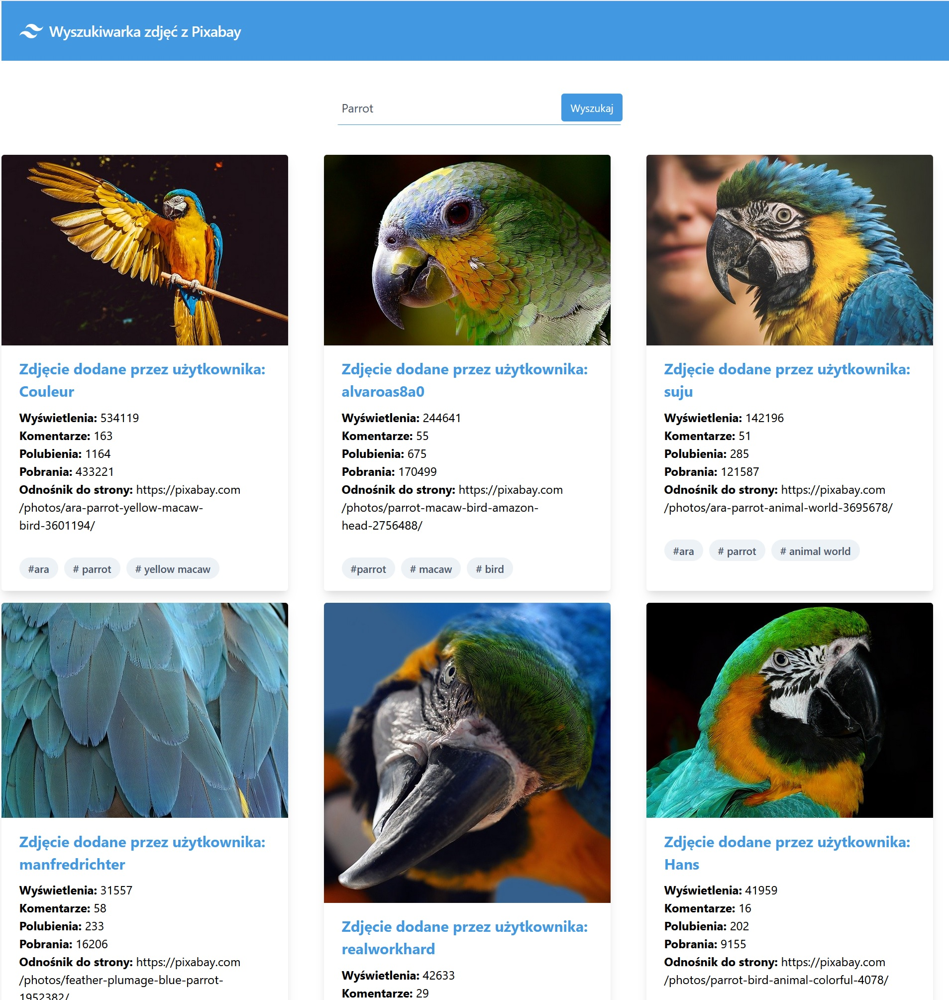

## Zawartość dokumentacji
* [Główne informacje](#general)
* [Jak działa?](#how)
* [Zdjęcia](#pictures)
* [Użyte technologie](#tech)
* [Jak uruchomić](#setup)

## Główne informacje
Przedstawiony projekt służy do wyszukiwania zdjęć z bazy danych Pixabay przy użyciu jego API.

	
## Jak działa?
Jego działanie jest bardzo proste. Wpisjąc w wyszukiwarkę angielską frazę np. "dog" otrzymamy w domyśle 20 zdjęć psów które zostają zaczerpnięte ze zbioru zdjęć Pixabay. Zdjęcia wyszukiwane są na podstawie tagów.<br/>
Dodatkowo przy każdym zdjęciu wyświetlony jest autor danego zdjęcia, ilość wyświetleń, polubień, komentarzy, a także cały adres URL do strony macierzystej.

## Zdjęcia



## Użyte technologie

- Tailwind CSS

## Jak uruchomić
Aby uruchomić projekt, należy zainstalować go lokalnie przy użyciu npm:

```
$ npm install

$ npm start
```

